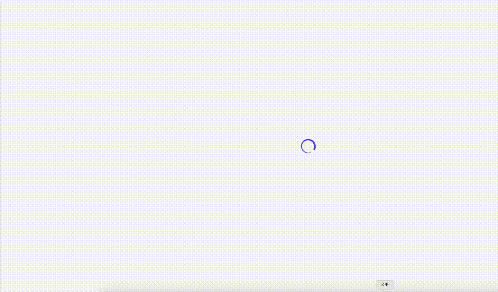

# strapi-plugin-dashboard-builder

Powerful plugins that let you tailor the admin interface to your needs.
Supports Strapi v5 or higher.



# Install

```
npm install strapi-plugin-dashboard-builder
```

# Dashboard Setting


Widgets can be manipulated by drag and drop.

You can freely customize the widgets displayed on your dashboard.

For example, you can show recent entries from a collection type like Blogs, or display images uploaded to the media library.

Additional widget types include pie charts, radar charts, and line graphs.

You can also create your own custom widgets using InjectionZones.

- [Chart Setting](./docs/chart.md)
- [Custom Widget Setting](./docs/cw.md)
