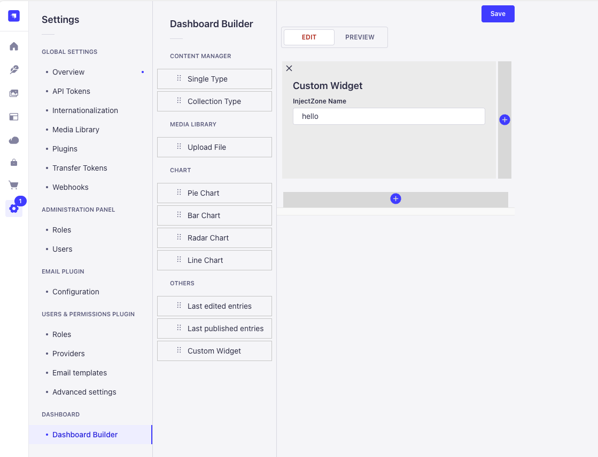
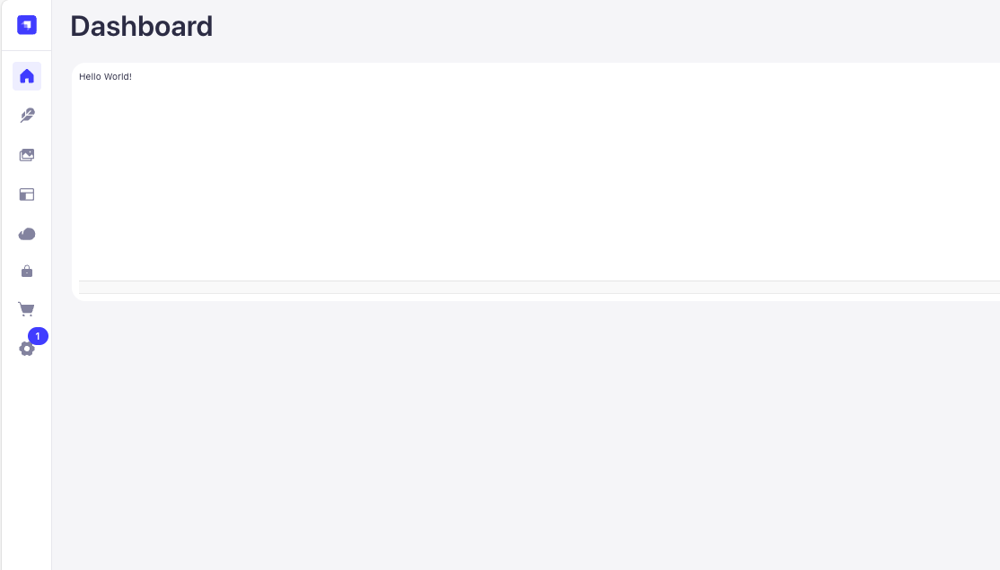

# Custom Widget Setting

Custom widgets allow users to display their own React components. They utilize Strapi's Injection Zones.

### Step1. Select a custom widget, give it a name of your choice, and save it.



### Step2. create a component in `app.tsx`

`src/admin/app.tsx`
```tsx
import type {StrapiApp} from '@strapi/strapi/admin';

export default {
  bootstrap(app: StrapiApp) {
  },
  register: (app: StrapiApp) => {
    const dashboardBuilder = app.getPlugin('dashboard-builder')
    dashboardBuilder.injectComponent('dashboard', 'customWidgets', {
      name: 'hello',
      Component: () => {
        return (
          <h1>Hello World!</h1>
        )
      }
    });
  }
};
```


